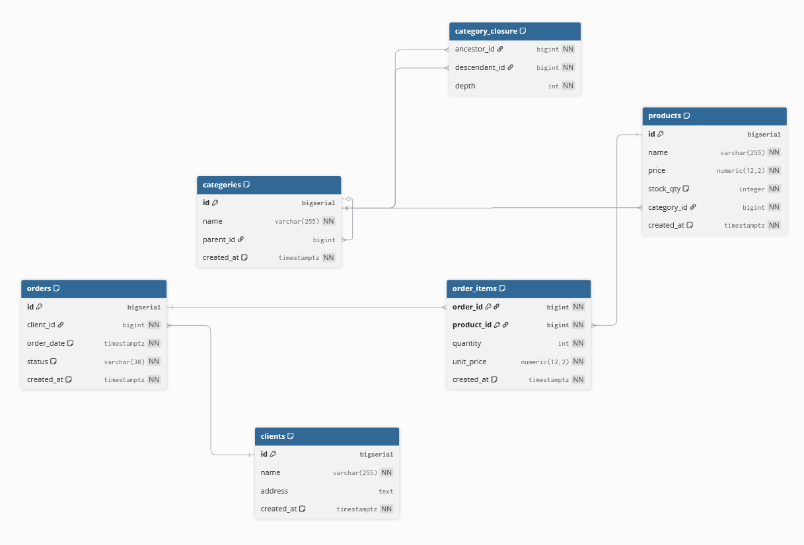

# AITI Guru — Тестовое задание
### **Задача:** спроектировать БД (с деревом категорий), написать SQL-запросы и реализовать REST-метод «добавить товар в заказ» с учётом конкурентного доступа и проверки остатков.

## Быстрый старт
1) Запуск через Docker
```docker compose up --build    ```

## Стректура проекта:
```
├── app.py                      # точка входа (FastAPI)
├── core
│   ├── config.py               # конфигурация (DATABASE_URL)
│   └── db.py                   # engine / session / Base
├── crud
│   └── order_items.py          # бизнес-логика добавления позиции в заказ
├── models
│   ├── category.py             # Category + CategoryClosure
│   ├── product.py              # Product
│   ├── client.py               # Client
│   ├── order.py                # Order
│   └── order_item.py           # OrderItem
├── routers
│   └── order_items.py          # HTTP-роутер
├── schemas
│   └── order_item.py           # Pydantic модели запроса/ответа
├── utils
│   └── init_db.py              # create_all
├── requirements.txt
├── Dockerfile
├── docker-compose.yml
└── .env.example
```

## Схема БД


```Table categories {
  id           bigserial [pk]
  name         varchar(255) [not null]
  parent_id    bigint [ref: > categories.id]
  created_at   timestamptz [not null, default: `now()`]

  Note: 'Категории товаров с неограниченной вложенностью'
}

Table category_closure {
  ancestor_id   bigint [not null, ref: > categories.id]
  descendant_id bigint [not null, ref: > categories.id]
  depth         int    [not null]

  indexes {
    (ancestor_id, descendant_id) [unique]
    (descendant_id, ancestor_id)
    (ancestor_id, depth)
  }

  Note: 'Closure-table для быстрых запросов по дереву (любой уровень)'
}

Table products {
  id           bigserial [pk]
  name         varchar(255) [not null]
  price        numeric(12,2) [not null]
  stock_qty    integer [not null, default: 0]
  category_id  bigint [not null, ref: > categories.id]
  created_at   timestamptz [not null, default: `now()`]

  indexes {
    (category_id)
    (name)
  }

  Note: 'Номенклатура'
}

Table clients {
  id          bigserial [pk]
  name        varchar(255) [not null]
  address     text
  created_at  timestamptz [not null, default: `now()`]

  indexes {
    (name)
  }
}

Table orders {
  id          bigserial [pk]
  client_id   bigint [not null, ref: > clients.id]
  order_date  timestamptz [not null, default: `now()`]
  status      varchar(30) [not null, default: 'created']
  created_at  timestamptz [not null, default: `now()`]

  indexes {
    (client_id)
    (order_date)
    (status)
  }

  Note: 'Заказы покупателей'
}

Table order_items {
  order_id    bigint [not null, ref: > orders.id]
  product_id  bigint [not null, ref: > products.id]
  quantity    int [not null]
  unit_price  numeric(12,2) [not null]
  created_at  timestamptz [not null, default: `now()`]

  Note: 'Состав заказа'

  indexes {
    (order_id)
    (product_id)
    (order_id, product_id) [pk]
  }
}```


## API
Добавить товар в заказ `POST /orders/{order_id}/items`

Request body
```{
  "product_id": 10,
  "quantity": 3
}```

Успешный ответ

```{
  "order_id": 1,
  "product_id": 10,
  "new_quantity_in_order": 7,
  "stock_left": 92
}```

Ошибки

- `404 Not Found` — заказ или товар не найден

- `409 Conflict` — недостаточно товара на складе

**Swagger:** /docs
Технически: внутри выполняется `SELECT … FOR UPDATE` по товару, затем UPSERT в `order_items` через `ON CONFLICT`, после — списание `stock_qty` и коммит одной транзакцией.
```

## SQL-запросы
1. Сумма заказов по каждому клиенту
```select
  c.name as client_name,
  coalesce(sum(oi.quantity * oi.unit_price), 0) as total_amount
from clients c
left join orders o on o.client_id = c.id
left join order_items oi on oi.order_id = o.id
group by c.name
order by total_amount desc;
```


2. Количество дочерних категорий 1-го уровня
```select
  p.id,
  p.name,
  count(c.id) as child_count_lvl1
from categories p
left join categories c on c.parent_id = p.id
group by p.id, p.name
order by child_count_lvl1 desc, p.name;
```

3. ТОП-5 товаров за 30 дней
```create or replace view v_top5_products_last_month as
with root_cat as (
  select
    cc.descendant_id as category_id,
    (array_agg(a.id order by cc.depth desc))[1] as root_id
  from category_closure cc
  join categories a on a.id = cc.ancestor_id
  where a.parent_id is null
  group by cc.descendant_id
)
select
  p.name as product_name,
  rc_root.name as category_lvl1,
  sum(oi.quantity) as total_qty
from order_items oi
join orders   o  on o.id = oi.order_id
join products p  on p.id = oi.product_id
left join root_cat rc     on rc.category_id = p.category_id
left join categories rc_root on rc_root.id = rc.root_id
where o.order_date >= (now() - interval '30 days')
group by p.name, rc_root.name
order by total_qty desc
limit 5;```
